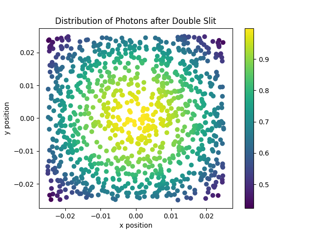

# Simulation-of-the-Double-Slit-Experiment-
Overview:
This project is a simulation of the double-slit diffraction experiment, which is a famous demonstration of the wave-particle duality of light. The simulation generates a set of photons, calculates their intensities using the Fraunhofer diffraction formula, and saves the results to a file. The results are then plotted using a Python script to visualize the distribution of photons after passing through the two slits.

Code Details:
The C++ code uses the Mersenne Twister algorithm to generate random positions for the photons. The intensities are calculated using the Fraunhofer diffraction formula. The results are stored in a vector of Photon structures, with each structure representing a single photon and its position and intensity. The results are then written to a file in a tab-separated format, with each line representing a single photon.

The Python script loads the data from the file, splits it into separate arrays for the x and y positions and the intensities, and creates a scatter plot using the matplotlib library. The color of each point represents the intensity of the photon.

Plot:

Conclusion:
This simulation provides a visual representation of the double-slit diffraction experiment, demonstrating the wave-particle duality of light. By generating random positions for the photons and calculating their intensities, the simulation shows how the photons interfere with each other to form a characteristic diffraction pattern.
